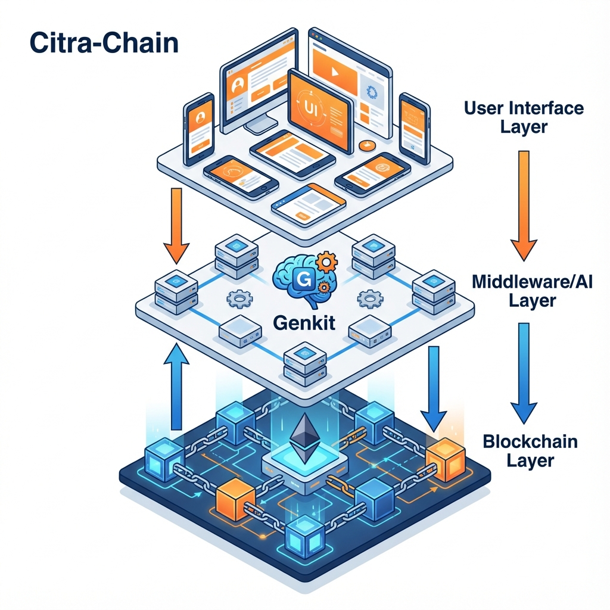

# Citra-Chain Architecture

This document outlines the technical architecture of the Citra-Chain decentralized application.

<div align="center">
  
  <p><i>High-Level System Overview</i></p>
</div>

## System Components

### 1. Frontend Layer (Next.js 15)
- **Role**: Interface for Farmers and Buyers to interact with the system.
- **Tech**: React, TypeScript, Tailwind CSS, Radix UI.
- **Hosting**: Vercel (recommended) / Local Node.js server.
- **Wallet Connection**: Uses `BrowserProvider` (via Ethers.js) to connect to Metamask.

### 2. Application/AI Layer
- **Role**: Intelligent data processing and validation.
- **Tech**: Google Genkit.
- **Function**: `data-accuracy-audit.ts` flow validates harvest data inputs before finding anomalies (off-chain logic).

### 3. Blockchain Layer (Ethereum)
- **Role**: Immutable ledger for batches and payments.
- **Contract**: `CitraChainMarket.sol`.
- **Data Stored**: 
  - Batches (`Batch` struct).
  - Ownership & State (`isActive`, `sold`).
- **Events**: `BatchCreated`, `BatchPurchased`, `BatchUpdated`.

---

## Data Flow Diagram

```mermaid
sequenceDiagram
    participant User as User (Farmer/Buyer)
    participant Client as Next.js Client
    participant AI as Genkit AI
    participant Chain as Ethereum Contract

    Note over User, Client: Use Case: Create Batch
    User->>Client: Input Harvest Details
    Client->>AI: Trigger 'data-accuracy-audit'
    AI-->>Client: Audit Result (Valid/Invalid)
    
    rect rgb(20, 30, 20)
        Note right of Client: If Valid
        Client->>User: Request Wallet Signature
        User->>Client: Sign Transaction
        Client->>Chain: createBatch(qty, price, date)
        Chain-->>Client: Emit BatchCreated Event
    end
    
    Client-->>User: Show Success Notification
```



## Component Architecture

```mermaid
graph TD
    subgraph Frontend "Next.js App Router"
        PageHome["/ (Landing)"]
        PageMarket["/marketplace (Listing)"]
        PageBatch["/batch/[id] (Details)"]
        
        CompWallet["WalletContext (Provider)"]
        CompNav["Navbar"]
        
        PageHome --> CompNav
        PageMarket --> CompNav
        PageMarket --> CompWallet
        PageBatch --> CompWallet
    end

    subgraph Actions "Server Actions / Lib"
        ActionGenkit["Genkit Flow (Audit)"]
        LibEthers["Ethers.js Client"]
    end

    subgraph Blockchain "Ethereum Network"
        Contract["CitraChainMarket.sol"]
    end

    PageMarket -- "Read: batches()" --> LibEthers
    PageMarket -- "Write: buyBatch()" --> LibEthers
    LibEthers -- "RPC Calls" --> Contract
    
    PageBatch -- "Audit Data" --> ActionGenkit
```
